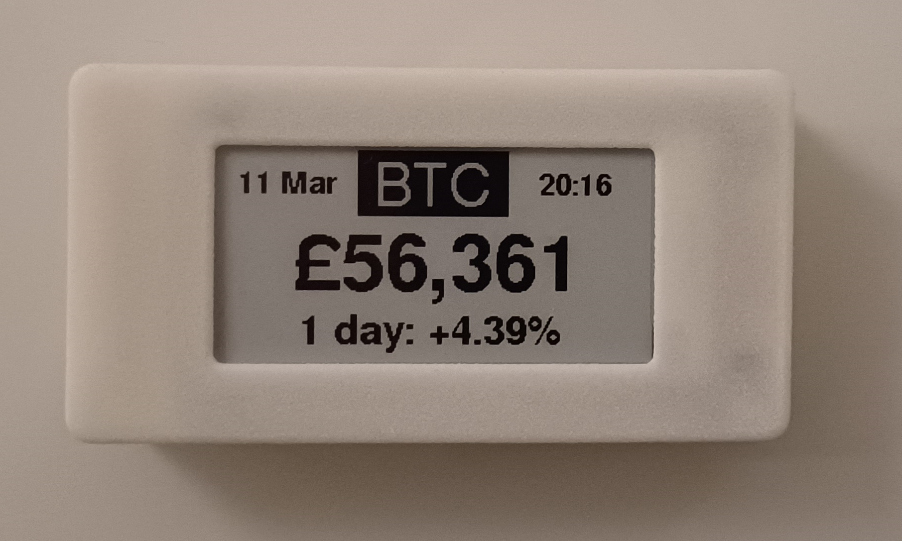
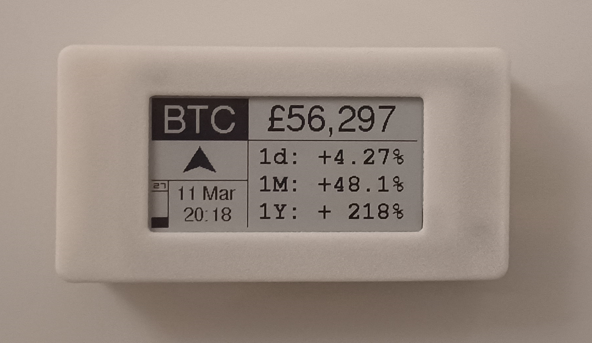

Project for creating a cryptocurrency price ticker, running on an ESP32 with a small ePaper display (~2in). The device will be battery powered.
Crypto only to start with since the data is very easy to get without any kind of auth. Maybe add stocks/fx after.

##### End goals:
- Standalone unit that is fully configurable through a remote connection
- Able to perform OTA software updates
- Battery life of up to 1 month
- As thin as possible, certainly less than 15mm. I estimate the dimensions will be around 80x40x12mm

#### This Repo 
This project is built with [PlatformIO](https://platformio.org/). Some files, e.g. custom fonts/bitmaps, project build configuration, and the config webpage are not included here

#### Real Product
These are some pictures of the final product in its 3D printed case. It measures 82x43x14mm.

  

<em>
	Real ticker in "simple" display mode
</em>

 

  

<em>
	Real ticker in "advanced" display mode
</em>

